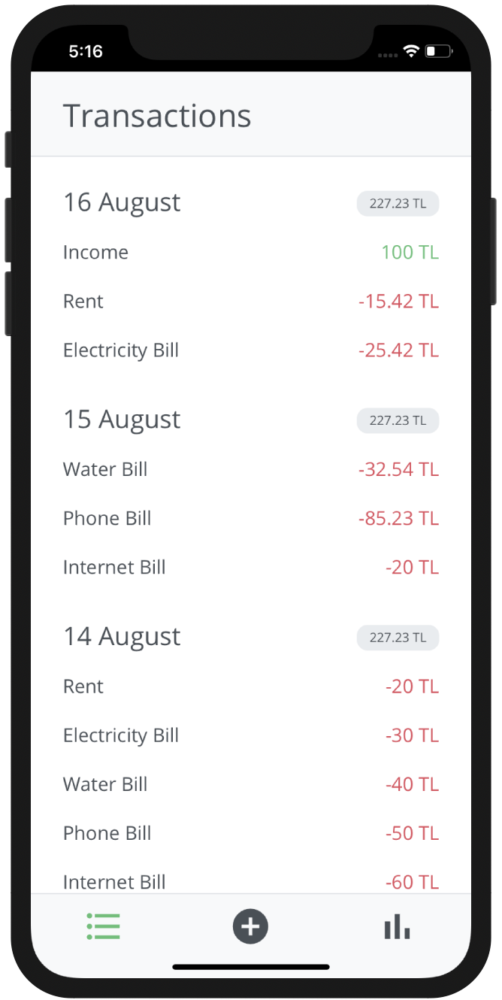
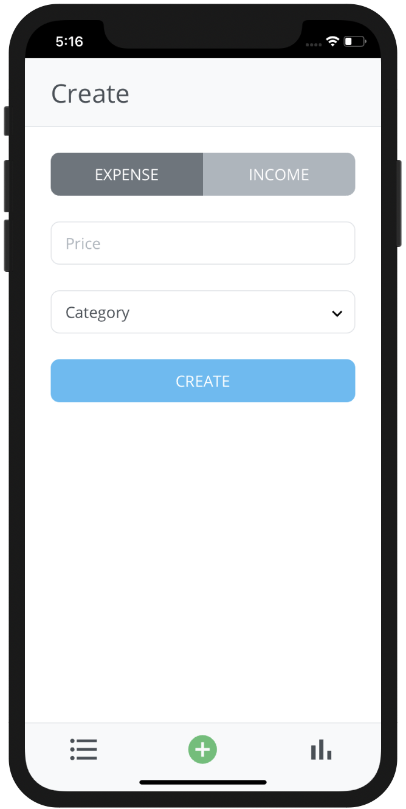
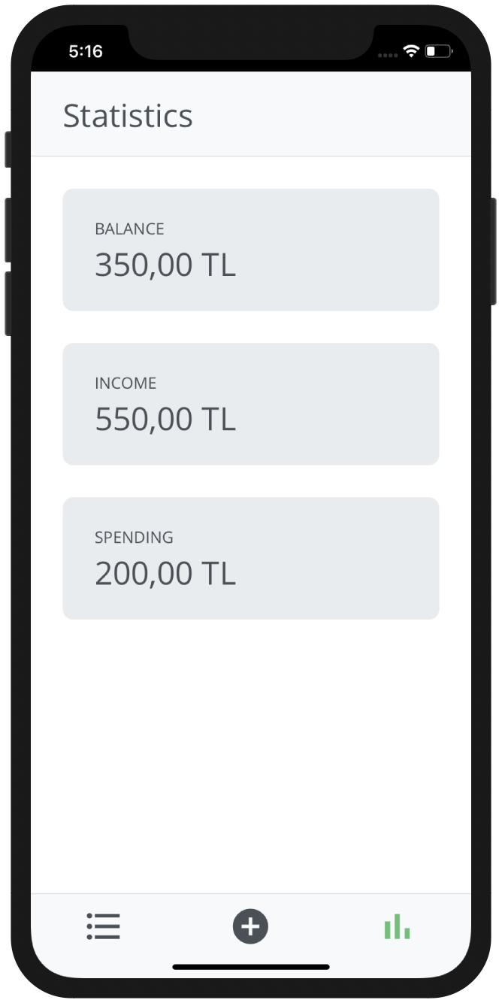

# Budget

A simple budgeting app for mobile devices.

## Deploying to Heroku

1. Create a [MongoDB Atlas Cluster](https://www.mongodb.com/cloud)
2. Click "Deploy to Heroku" button above and create your Heroku app
3. Create config variables (can be found in [./.env.example](.env.example) file) in your app settings on Heroku
4. Restart your dyno and you're ready to go

## Preview

  

## Todos

- [x] User interface
- [x] Create transactions
- [x] Read transactions
- [x] Update transactions
- [x] Delete transactions
- [ ] Create categories
- [ ] Read categories
- [ ] Update categories
- [ ] Delete categories
- [ ] Add settings page
- [x] Add statistics page
